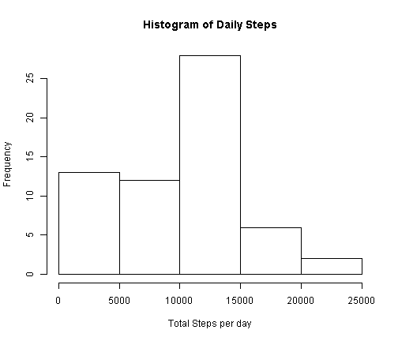
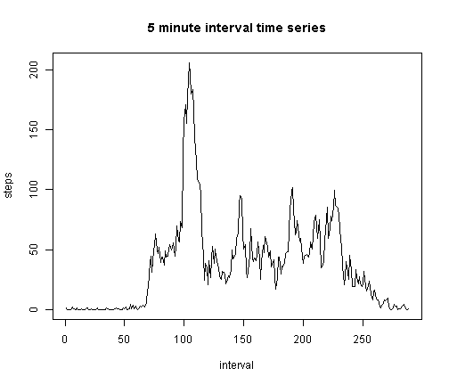
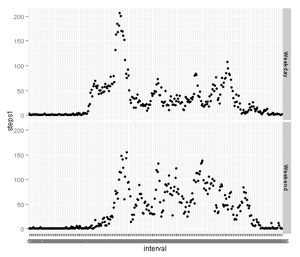

## Loading and preprocessing the data
To load the data you first make sure the working directory has the zip file.The zip file(activity) was unzipped in R. The following code was used:

```r
#get working directory
getwd()
```

```
## [1] "C:/Users/Beatrice Muse/Documents/represearch/RepData_PeerAssessment1"
```

```r
#unzip file
activity=unzip('activity.zip',list=F)
proj_data=read.csv('activity.csv',head=T,na.strings="NA")
attach(proj_data)
```


## What is mean total number of steps taken per day?
The total numberof steps per day was first computed.A histogram of the total daily steps was then plotted using the base plotting system.

```r
frequency=tapply(steps,date,sum,na.rm=T)
daily_mean=mean(frequency) #mean of total daily steps
daily_median=median(frequency)
hist(frequency,xlab="Total Steps per day",main="Histogram of Daily Steps")
```

 

The mean **9354.23** and median was **10395**


## What is the average daily activity pattern?
The average daily activity was as follows.For simplicity, the interval was converted to a factor.
The r code used was:

```r
proj_data$interval=factor(proj_data$interval)
Average=aggregate(steps~interval,data=proj_data,na.action=na.omit,FUN=mean)
max=Average[Average$steps==max(Average$steps),]
with(Average,plot.ts(interval,steps,type='l',main="5 minute interval time series"))
```

 

The five minute interval with the highest number of steps was **835**

## Imputing missing values
The missing values were replaced with median of the data.

```r
library(zoo)
```

```
## Warning: package 'zoo' was built under R version 3.1.2
```

```
## 
## Attaching package: 'zoo'
## 
## The following objects are masked from 'package:base':
## 
##     as.Date, as.Date.numeric
```

```r
#fill missing by median interval
proj_data$steps1=na.aggregate(proj_data$steps,by=proj_data$interval, FUN=median)
detach(proj_data)
new_data=proj_data[,2:4]
#create total per day
attach(new_data)
total_steps=tapply(steps1,date,sum)
hist(total_steps,xlab="Total Steps per day",main="Histogram of Daily Steps")
```

 

```r
complete_mean=mean(total_steps)
complete_median=median(total_steps)
```

The mean of the new data set is **9503.8688525** while the median is **10395**.

## Are there differences in activity patterns between weekdays and weekends?
The weekday was first extracted.The if statement was then used to generate the factor variable with the levels Weekday and Weekend respectively.
The code is as follows:

```r
#create weekdays
new_data$date=as.Date(new_data$date)
new_data$Week=weekdays(new_data$date)
for (i in 1:nrow(new_data)){
 if (new_data$Week[i] %in% c('Saturday','Sunday'))
{new_data$Week[i]="Weekend"}else
{new_data$Week[i]="Weekday"}
}
library(ggplot2)
```

```
## Warning: package 'ggplot2' was built under R version 3.1.2
```

```r
attach(new_data)
```

```
## The following objects are masked from new_data (pos = 4):
## 
##     date, interval, steps1
```

```r
interval=factor(interval)
weekaverage=aggregate(steps1~interval*Week,data=proj_data,FUN=mean)
qplot(interval,steps1,data=weekaverage,type='l',facets=Week~.)
```

 
